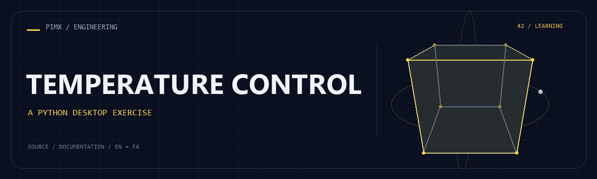

<div align="center">



**[English](README.md) · [فارسی](README.fa.md)**

</div>

# 🌡️ TEMPERATURE CONTROL

A simulated temperature controller with increase/decrease buttons and heater/cooler status labels.

[GitHub](https://github.com/MOHAMMADREZAABEDINPOOR/temperuture) · [PIMX / Profile](https://github.com/MOHAMMADREZAABEDINPOOR) · [Static artwork](assets/readme/hero.png)

| At a glance | Details |
|:---|:---|
| 🌡️ Experience | Learning exercise / source archive |
| 🧰 Built with | `Python` |
| 🌐 Documentation | [English](README.md) · [فارسی](README.fa.md) |

[✨ Features](#features) · [🚀 Getting started](#getting-started) · [⚙️ Configuration](#configuration) · [🌍 Deployment](#deployment)

---

<a id="features"></a>

## ✨ Features

| Area | Included capability |
|:---|:---|
| ⚡ Workflow | Adjustable simulated temperature |
| ⚡ Workflow | Tkinter controls |
| ⚡ Workflow | Threshold-based status text |

<a id="stack"></a>

## 🧰 Stack

| Tool | Version / source |
|---|---|
| Python | `standard library / source imports` |

<a id="getting-started"></a>

## 🚀 Getting started

Python 3; a desktop/Tk installation for Tkinter or turtle examples. Tkinter is provided by the Python installation, not pip. Legacy dependencies may need a compatible Python version.

```bash
git clone https://github.com/MOHAMMADREZAABEDINPOOR/temperuture.git
cd temperuture

python "temperuture.py"
```

<a id="configuration"></a>

## ⚙️ Configuration

No standard environment template is defined. Standalone exercises need no external configuration; inspect any service constants or paths in the source before running.

<a id="usage"></a>

## 🎯 Usage

Run the script and use the arrow buttons to change the simulated temperature.

<a id="project-structure"></a>

## 🗂️ Project structure

| Path | Role |
|---|---|
| [`assets/`](assets/) | Brand/media/README assets |
| [`temperuture.py`](temperuture.py) | Project entry/configuration file |

<a id="commands-and-checks"></a>

## 🧪 Commands and checks

No automated test command is declared in a manifest. Verify behavior through a local example run.

<a id="deployment"></a>

## 🌍 Deployment

This is a local learning exercise, not a public service. Browser exercises can use static hosting.

<a id="limitations"></a>

## 📌 Limitations

This does not read a sensor or control physical hardware.

<a id="troubleshooting"></a>

## 🛠️ Troubleshooting

- GUI unavailable: use a desktop Python installation with Tk for Tkinter/turtle examples.
- Invalid input: use the numeric/text format expected by the selected script.

<a id="contributing"></a>

## 🤝 Contributing

Create a focused branch, verify the affected behavior and explain the change clearly. Keep private data, build outputs and local databases out of commits.

<a id="license"></a>

## 📄 License

No repository-level license file is included in this snapshot. Public visibility alone does not grant reuse rights; contact the repository owner for terms.

---

Part of **PIMX** · Documentation in English and Persian.

---

<div align="center">

🌡️ **TEMPERATURE CONTROL** · [English](README.md) · [فارسی](README.fa.md)

</div>
